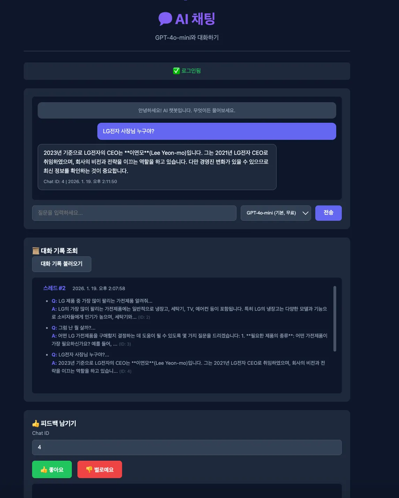
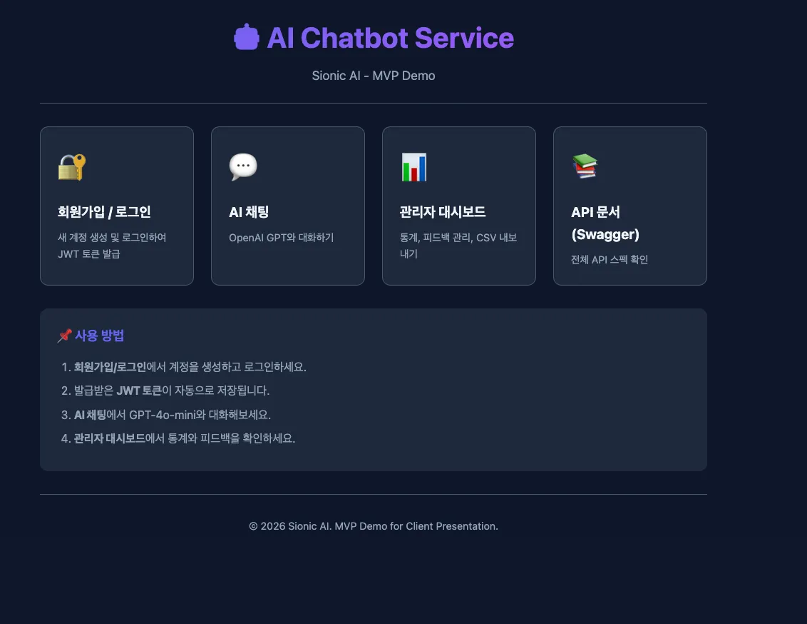
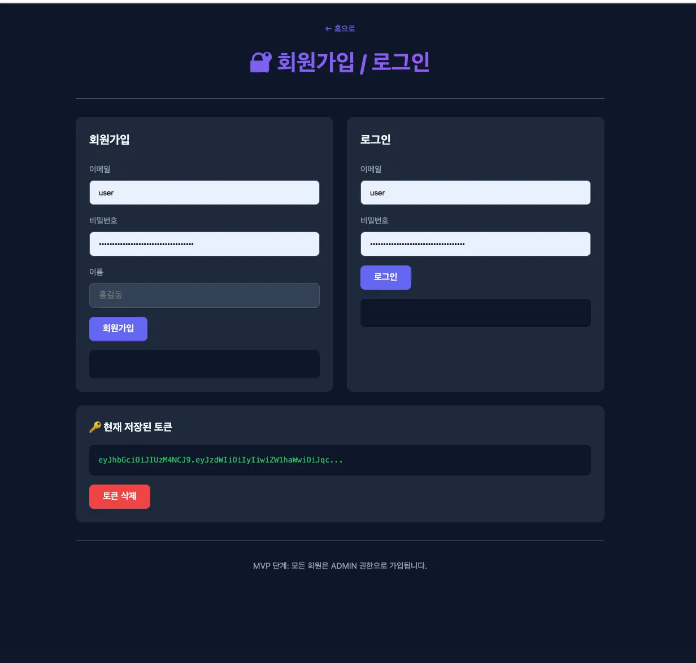
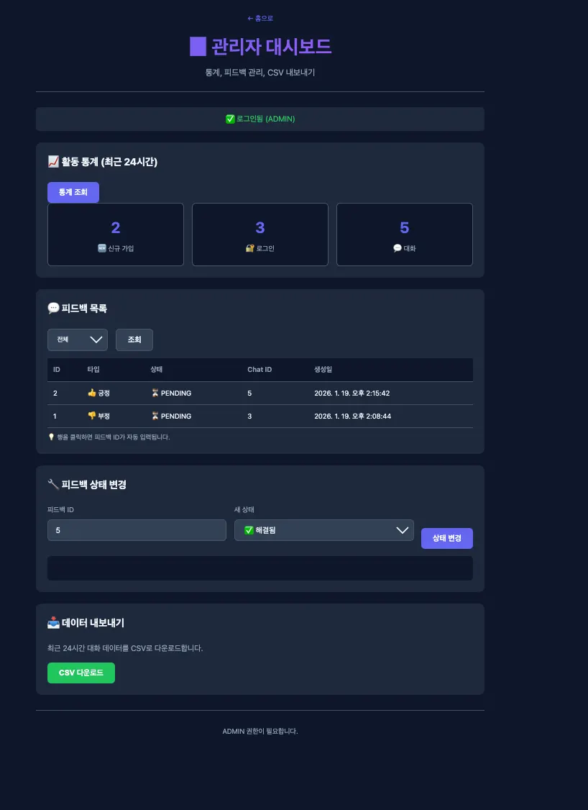
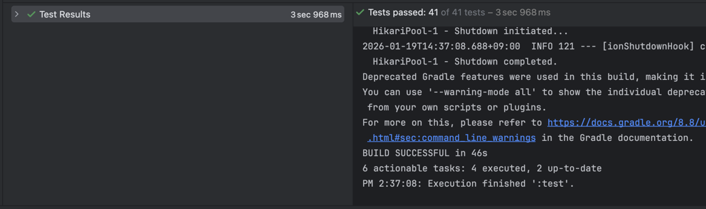

# AI Chatbot Service

Spring Boot + Kotlin 기반의 AI 챗봇 서비스입니다.


## 실행 방법

**테스트 용이성을 위해 application.yml에 openAi 무료 키를 넣어놨습니다**

```bash
# 서버 실행
./gradlew bootRun

# 테스트 실행
./gradlew test
```

- Swagger UI: http://localhost:8080/swagger-ui.html
- Demo 페이지: http://localhost:8080/demo

---

## 1. 과제 분석

AI를 통해 빠르게 요구사항을 분석하고 구현 계획을 수립했습니다.
그 과정에서 엣지케이스와 확장성도 함께 고려하라고 프롬프트하였습니다.
MVP 구현에 집중하기 위해 필요하지는 않지만, 기술적으로 어렵지 않다면 일반 구현과 시간차이가 나지 않기 때문에 엣지케이스와 확장성도 고려하였습니다. 

요구사항을 **핵심 기능**과 **MVP 범위**로 분리하여 분석했습니다:

| 핵심 기능 | 설명 |
|-----------|------|
| 인증 | JWT 기반 회원가입/로그인 |
| 채팅 | OpenAI API 연동, 스레드 그룹핑 (30분 기준) |
| 피드백 | 대화별 좋아요/싫어요 |
| 관리자 | 통계 조회, CSV 내보내기 |

또한, 고객사에게 직관적인 시연을 위해 Swagger UI 외에 Thymeleaf 기반의 간단한 웹 UI도 구현하는 것이 핵심이라고 생각했습니다.
물론, 시간이 부족하면 MVP에서 제외할 수도 있다고 판단했겠지만, AI로 만들 시 Thymeleaf UI는 구현 난이도가 낮고 시연 효과가 크기 때문에 핵심 기능으로 포함시켰습니다.

---

## 2. AI 활용

1. 구현 전 Antigravity Gemini 에게 요구사항 분석과 설계, 기술적 의사결정을 맡겼습니다.
2. required.md의 요구사항을 바탕으로 상세 요구사항, 엣지 케이스, 확장성 고려사항을 포함하여 new_required.md를 생성했습니다.
3. new_required.md를 바탕으로 기술적 의사결정 문서 TODO_LIST.md를 생성했습니다.
4. TODO_LIST.md를 바탕으로 구현 Antigravity Claude Ops에게 구현을 시켰습니다
5. 개발 도중 발생하는 문제들을 TROUBLESHOOTING.md에 기록하고 의사결정 과정도 decision_making.md 에 기록하게 하였습니다.

모든 md 문서는 docs/ 폴더에 저장되어 있습니다.

### 어려움
- **컨텍스트 유실**: 대화가 길어지면 이전 결정사항을 잊어버림 → `docs/의사결정.md`에 주요 결정 기록
- **과도한 구현**: 요구하지 않은 기능까지 구현 → 범위 명시 및 즉시 롤백

---

## 3. 가장 어려웠던 기능

### SSE 스트리밍 응답 (MVP 제외)

**목표**: OpenAI API의 스트리밍 응답을 SSE로 클라이언트에 실시간 전달

**어려웠던 점**:
- `@Transactional` + SSE 조합 시 `read-only transaction` 예외 발생
- 비동기 스레드에서 트랜잭션 컨텍스트 유실
- SSE 연결 종료 시점과 DB 저장 타이밍 동기화

**결정**: 
제한된 시간 내 안정적인 MVP 구현이 우선이므로, **스트리밍 기능은 제외**하고 동기 HTTP 방식으로 구현했습니다. 트러블슈팅 과정은 `docs/TROUBLESHOOTING.md`에 기록해두었습니다.

```
# 향후 개선 시 고려사항
1. TransactionTemplate으로 수동 트랜잭션 관리
2. 응답 완료 후 별도 스레드에서 DB 저장
3. emitter.send() 예외 처리로 연결 끊김 대응
```

---

## 시연 화면
Demo 페이지: http://localhost:8080/demo












## 기술 스택

- Kotlin, Spring Boot 3.x
- JPA, PostgreSQL, H2 (테스트)
- JWT, Spring Security
- OpenAI API
- Swagger, Thymeleaf (데모 UI)
